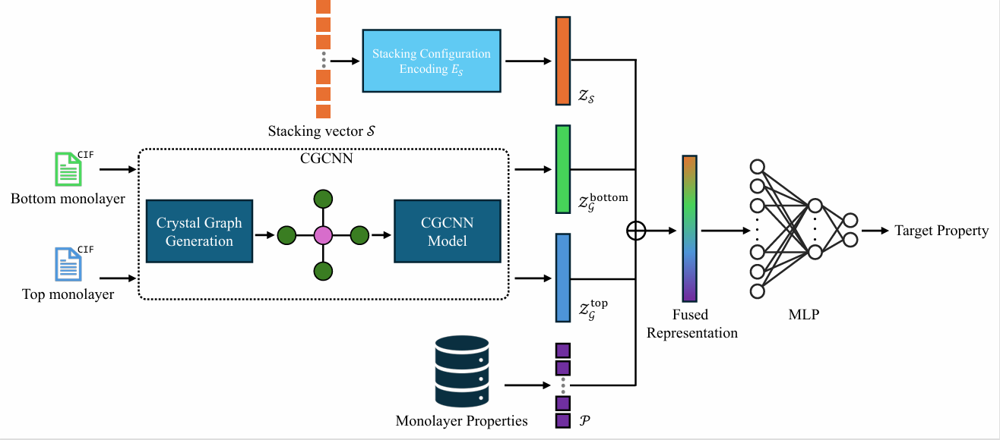

Official code repository of paper “Property Prediction of Stacked Bilayer Materials: A Multimodal Learning Approach” by An Vuong, Minh-Hao Van, Chen Zhao, and Xintao Wu. [IJCAI-ECAI 2026]



## Prerequisites

This project requires Python and the following libraries:

- PyTorch (`torch`)
- scikit-learn
- pymatgen

We recommend creating a dedicated Conda environment named `bimat_ml`.

### Create the environment

```bash
conda create -n bimat_ml python=3.10 -y
conda activate bimat_ml
```

### Install dependencies

Install PyTorch with CUDA 12.1 support:

```bash
pip install torch torchvision torchaudio --index-url https://download.pytorch.org/whl/cu121
```

Install the remaining required libraries:

```bash
pip install scikit-learn pymatgen
```

## Training and Prediction Scripts

This repository provides training and prediction scripts for four settings. All scripts are run using **4-fold cross validation**.

1. **BiDB with monolayer-based representation (Bimat-ML)**
2. **BiDB with bilayer-based representation (Direct)**
3. **HetDB with monolayer-based representation (Bimat-ML)**
4. **HetDB with bilayer-based representation (Direct)**

The argument `--mono` controls whether monolayer properties are used:

- `--mono 1`: use monolayer properties.
- `--mono 2`: do not use monolayer properties.

Pre-trained models for all folds are provided in the `pre-trained/` directory and can be used directly for prediction.

---

### 1. BiDB: Homogeneous Bilayers with Monolayer-based Representation (Bimat-ML)

This setting uses the top and bottom monolayer CIFs together with stacking information to predict the bilayer bandgap.

**Training script:**

To train with monolayer properties:

```bash
python main_kfold_bimono.py --mono 1
```

To train without monolayer properties:

```bash
python main_kfold_bimono.py --mono 2
```

**Prediction script:**

To predict with monolayer properties:

```bash
python predict_kfold_bimono.py --mono 1
```

To predict without monolayer properties:

```bash
python predict_kfold_bimono.py --mono 2
```

---

### 2. BiDB: Homogeneous Bilayers with Bilayer-based Representation (Direct)

This setting uses full bilayer CIFs to predict the bandgap of homogeneous bilayer materials.

**Training script:**

To train with monolayer properties:

```bash
python main_kfold_bidb.py --mono 1
```

To train without monolayer properties:

```bash
python main_kfold_bidb.py --mono 2
```

**Prediction script:**

To predict with monolayer properties:

```bash
python predict_kfold_bidb.py --mono 1
```

To predict without monolayer properties:

```bash
python predict_kfold_bidb.py --mono 2
```

---

### 3. HetDB: Heterogeneous Bilayers with Monolayer-based Representation (Bimat-ML)

This setting uses the top and bottom monolayer CIFs to predict the bilayer bandgap.

**Training script:**

To train with monolayer properties:

```bash
python main_kfold_hetmono.py --mono 1
```

To train with monolayer properties:

```bash
python main_kfold_hetmono.py --mono 2
```

**Prediction script:**

To predict with monolayer properties:

```bash
python predict_kfold_hetmono.py --mono 1
```

To predict without monolayer properties:

```bash
python predict_kfold_hetmono.py --mono 1
```

---

### 4. HetDB: Heterogeneous Bilayers with Bilayer-based Representation (Direct)

This setting uses full bilayer CIFs to predict the bandgap of heterogeneous bilayer materials.

**Training script:**

To train with monolayer properties:

```bash
python main_kfold_hetdb.py --mono 1
```

To train without monolayer properties:

```bash
python main_kfold_hetdb.py --mono 2
```

**Prediction script:**

To predict with monolayer properties:

```bash
python predict_kfold_hetdb.py --mono 1
```

To predict without monolayer properties:

```bash
python predict_kfold_hetdb.py --mono 2
```
